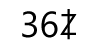

# Dozenal: Superior Numeral System for Human Use

## The primary numeral system for [Star City](https://github.com/WebDevBooster/star-city-manifesto)

---

  
Table of Contents (click to expand)

  
  ### [1 The Why](#the-why)
  * [1.1 Dozenal vs. decimal](#dozenal-is-2x-better-than-decimal)
  * [1.2 Counting in dozenal](#zero-one-two-three-four-five-six-seven-eight-nine-dek-el)
   
  ### [2 Dozenal Societies](#dozenal-societies)
  ### [3 The Guidelines](#the-guidelines)
  * [3.1 Summary](#summary)
  * [3.2 Dozenal checklist](#dozenal-elements-checklist)
  ### [4 The How](#the-how)
  * [4.1 Numerical representation of dek and el](#numerical-representation-of-dek-and-el)
  * [4.2 Base notation](#base-notation)
  * [4.3 Fraction notation](#fraction-notation)
  * [4.4 Hardware and software calculators](#hardware-and-software-calculators)
  * [4.5 Pronunciation](#pronunciation)
    - [4.5.1 From 'X to '1E](#from-x-to-1e)
    - [4.5.2 From '20 to '3E](#from-20-to-3e)
    - [4.5.3 From '20 to 'E0](#from-20-to-e0)
    - [4.5.4 From '100 to '1,000,000,000,000](#from-100-to-1000000000000)
    - [4.5.5 Big numbers](#big-numbers)
  ### [5 Percentage etc.](#percentage-etc)
  ### [6 Dozenal is NEVER "duodecimal"!](#dozenal-is-never-duodecimal)
  

--- 

## The Why

### Dozenal is 2x better than decimal.

Why aren't people using the [**binary**](https://en.wikipedia.org/wiki/Binary_number) system of numerals in day-to-day life? After all, computers can and do calculate EVERYTHING using just ones and zeros. All calculations in maths, engineering, programming, science... ALL of them can be done perfectly well using the binary system. 

So, shouldn't we all just switch to using ones and zeros (just 2 numbers) for counting and calculating everything?

Why do humans use a base-ten i.e. the decimal system instead of the binary system?

Because for *human use* the binary system is super-clunky. That's why. 

While perfect for computers, the binary system is *hard to use* for humans in daily life. That's why most people prefer to use the decimal system in normal day-to-day life. You know, using ten numbers 0 to 9. 

But what if there was a numeral system that's not just slightly better but **TWO TIMES BETTER than decimal?** 

For humans. In daily life. 

Well, such system exists. It's called **dozenal** and instead of ten numbers it uses twelve numbers: zero to el. 

So, each of the twelve numbers in dozenal is a **single digit** number. The number ten is called **dek** in dozenal and the biggest single digit dozenal number is called **el**. 

### Zero, one, two, three, four, five, six, seven, eight, nine, dek, el.

And instead of counting to just ten on your hands (like a medieval peasant), you can use those same two hands to count to a **DOZEN DOZENS!** (that's 144 for medieval peasants)

How?

Use the thumb of your dominant hand to touch each of the twelve finger bones (phalanges) starting with red and ending with **GOLD** while counting: 

One, two, three, four, five, six, seven, eight, nine, dek, el, dozen.

To keep track of this first dozen, use the thumb of your other hand to touch and *hold* the first (red) phalange there. Now start counting the next dozen on your dominant hand and so on. 

You can count to a **DOZEN DOZENS** doing that.

Don't worry, we also have a short word for *dozen* and we have a single short word for "dozen dozens" but you are just a beginner now. Baby steps.

What's that?... 

*This is more than twice better?*

Well, I'm glad you already agree that the dozenal system is MUCH BETTER. :-)
 
But here's what I meant by "2x better": 

In layman's terms a *divisor* or a *factor* is a number than can be used to divide another number so that nothing remains. "Clean" division with *no remainder*, no fractions. That's the idea. 

In every-day life — **as a human** — you want a numeral system that gives you as many divisors/factors as possible because dealing with fractions like 3.333333333333333 or 2.666666666666667 is nasty, annoying and... *inhuman*. 

It stinks!

You don't want to ever see those stinky fractions in your normal day-to-day life. You have better things to do than squeezing your nose in response to the agonizing pain caused by that stench. 

That's because we are human. Not robots. 

As humans we like when things are neat, clean, nice and tidy. It just feels good. It makes you smile. And it smells like the best royal fragrance you can imagine. Yes, it smells like royalty and the best thing is: you can hold it in your hands. You can **count** on it. And of course, you can also use it to count. And calculate. 

Long story short, when ignoring *trivial* divisors (every number can be divided cleanly by 1 and by itself), the number ten can only be divided by *two* and in *half*. So, only two non-trivial divisors for medieval peasants. That's why they stink so much. They constantly have to deal with those stinky fractions. Forever. 

But when you ascend to the royal status by switching to the dozenal system, you gain TWO additional non-trivial divisors. Because not only can a dozen be divided cleanly by *two* and in *half* but things also remain squeeky clean when a dozen is divided by *three* or by *four*. 
 
### TWO TIMES MORE non-trivial divisors is 2x better for day-to-day human use.

This is why the dozenal system will be the primary numeral system in [Star City](https://github.com/WebDevBooster/star-city-manifesto). It's 2 times better (for daily human use) and **everything** in Star City will be at least 2 times better compared to what you're used to.

Our computers will keep using the binary system because that's better for *them*. And in engineering and programming we might keep using the decimal system (for backward compatibility etc.). But for day-to-day *human* use the dozenal system is superior to the decimal system. That's a fact. 

By the way, in Star City, we'll also be using a [completely new calendar system](https://github.com/WebDevBooster/Starlendar) that you'll especially enjoy after your ascend to the dozenal royalty. :-)

---

## Dozenal Societies

Before we talk about the *how*, I'm gonna say something that some might consider "controversial". I'm aware that things like the Dozenal Society of Great Britain and the Dozenal Society of America exist. And I say that: 

### It's safe to *ignore* what the Dozenal Society of Great Britain or the Dozenal Society of America have ever said or done.

Why? 

If someone doesn't understand even the most fundamental BASICS of persuasion i.e. something that's required for anyone who is even remotely serious about establishing this system in the world, then they should stay OUT of a conversation. Until they learn at least those ***rudimentary BASICS***. 

It might only take half an hour to learn the basics but you gotta do it before you try to "chip in" in a conversation on the topic. 

If someone doesn't even know that `1 + 1 = 2` in maths, you can't take them seriously if they try to join a conversation about differential equations. One can't fail any harder if they think that `1 + 1 = 11` **in maths**. Mathematical rules are crystal clear. `1 + 1` always equals `2` in maths. No ambiguity, no exceptions. 

That's a metaphor to say that people running those societies are as clueless about the most rudimentary basics of persuasion as it gets. They need to understand at least those BASICS before they can join this conversation. 

But hey, those societies can do whatever they want. 

I'm just saying that **in Star City** we'll completely ignore their suggestions. 

And the ultimate "proof" will be "in the pudding". 

In other words, the only thing that matters in the end are the RESULTS.  
Results as in: 

### How many people are actually *using* the system you're promoting?

I can tell you that even blindfolded and with both of my hands tied behind my back, I'll get more people to use the dozenal system than all of those societies combined. So, whatever those societies are saying or proposing, **it doesn't matter**. I ignore it. 

--- 

## The Guidelines

The following guidelines are meant to allow anyone to join this discussion or work on the development of the dozenal system. Even if you aren't a persuasion expert. 

It's possible that we might deviate from these guidelines on occasion, but the aim should be to keep as close to them as possible. 

The core idea is: 

We aren't introducing the dozenal system in a vacuum. We are competing with a firmly established decimal system. It IS a competition! 

So, ideally, ***every single element*** of the dozenal system we introduce... ***every single word*** etc. should be **AT LEAST AS GOOD OR BETTER** than the decimal counterpart!

**AT LEAST AS GOOD OR BETTER!**

Every little thing!

If even just one little thing in our dozenal system is inferior or ***seems*** inferior... ***feels*** inferior... ***sounds*** inferior compared to the decimal counterpart, that's unacceptable. 

EVERY little thing must be **AT LEAST AS GOOD OR BETTER!**

I'll give you one example to get you on the right track:

The **proposed** dozenal counterpart for the word *hundred* is "gross". And according to [this Wikipedia page](https://en.wikipedia.org/wiki/Gross_%28unit%29) that word/name seems to have a historical or traditional background. 

Now, the question is: What's wrong with that? 

What's wrong with using the word "gross" as the dozenal counterpart for the word *hundred*?

Based on the core idea of this chapter, you should be able to immediately answer that question. You should immediately KNOW — within the first **second** of you reading that word — why it cannot be used for our purposes.

And if you do know... if you ***felt*** within a split-second of you reading that word the reason why we absolutely cannot use that word for our purposes, then congratulations! You've passed the test.

Even without being a persuasion expert you can now discuss this topic and make meaningful contributions to developing this system. 

*But shouldn't we respect the traditional background of the word "gross" and use it anyway?*

Here's a brilliant definition of the word tradition: 

> **Tradition**  
> *Peer pressure from dead people.*

In Star City, we'll actively try to break and DESTROY as many traditions as we can get our hands on. And then we'll create our own traditions (if we feel like it). 

Oh, and in case you happen to be a slow learner, [Wiktionary lists](https://en.wiktionary.org/wiki/gross) a number of different defininions of the word "gross". Among them: 

> *(of behaviour considered to be wrong)* Highly or conspicuously offensive.

or 

> *(slang, Canada, US)* Causing disgust.

or 

> Lacking refinement in behaviour or manner; offending a standard of morality.

Those are all *modern* definitions of the word. And while those are all definitions of "gross" as the adjective and not as the noun, it doesn't matter. 

What matters is what people instinctively ***feel*** when using that word. Feel within a split-second. 

Would using the word "gross" as the dozenal counterpart to the word hundred FEEL that this word is **AT LEAST AS GOOD OR BETTER** than the word *hundred*? 

No, it wouldn't. End of story. 

Here's another example... And this is gonna be your final test question if you wanna level up. 

The word dozen is a great word on many occasions. Especially if you want to emphasize. But we also need a shorter counterpart to the word ten. 

The **proposed** dozenal counterpart for that is "doe".

Now, tell me: What's wrong with that?

If you can see several things, what's the **main** reason why "doe" cannot be used as the dozenal counterpart to the word ten?

It's lame. That's the main reason. Go ahead, say that word out loud. Can you feel how lame-ass "doe" feels when compared to *ten*?

In pronunciation, *ten* feels snappy and fast. In contrast to that, "doe" feels like a lame, 3-legged donkey. 

So, there's zero chance we'll ever use that word for this purpose. 

See how much emphasis there is on FEELINGS?

That's because people make decisions based on emotions and then, later, justify those decisions with logic. 

When you present this new dozenal system to them, people will decide within 3 SECONDS whether they like it or not. So, 3 seconds is the MAXIMUM you've got. Many people will decide long before the 3 seconds are up. The emotional, gut-level ***feeling*** is what will make them decide. 

And if you roll up with a lame-ass donkey, the decision is gonna be against you. Good night! 

Now, that you've leveled up to the status of a "persuasion master", you are ready for the third and most advanced example. The biggest single digit numbers in the dozenal system are the number *dek* and the number *el*. 

But here's the problem: Neither of those numbers has a counterpart in the decimal system. Both numbers are unique. So, what do you do now? How do you make sure that both numbers are **AT LEAST AS GOOD OR BETTER** than their decimal counterparts if they don't have any counterparts in the decimal system?

This is something you can only handle as a "persuasion master" and since you've reached that level (congratulations!), you are equipped to handle this. 

To be clear: Right now, we are only talking about the **names** of those numbers. Their names in English, not their numerical representation. So, the words "dek" and "el" are the subject of this discussion. 

There's nothing in the decimal system to compare them to. No counterparts. 

In this case, you have to take an analytical approach while still keeping in mind that your gut is the ***primary*** decision-maker. Your gut feelings, your emotions take precedence over any analytics. Because every other human will react exactly the same way. 

So, number "dek". Only 3 characters. Nice and short. No idiotic letter "c" nonsense, no "ck", just one letter "k" at the end as it should be where you have a "k" sound. CLEAN! 

OK, it "looks" good but how does it FEEL? And how does it sound?

Well, it sounds nice and snappy. Energetic. Dynamic. And it feels GREAT! 

What about the number "el" then? 

The word for number "el" only consists of 2 letters. Wow! It doesn't get any shorter than that. And it feels and sounds amazing. The beauty and simplicity of that word is mesmerizing. It will make every dozenal user happy that the word for the single digit number with the highest value is such a beauty. 

The word "el" also has a mnemonic connection to the word "eleven". That's a bonus. 

Perfect! With *dek* and *el* we have two words that have already been engineered to perfection. So, we can copy them as is. I don't know who has engineered those words, but they've done an excellent job. 

### Summary

Every element of the dozenal system must *look, feel and sound* **AT LEAST AS GOOD OR BETTER** than their decimal counterpart. And if no such counterparts exist, the elements must *look, feel and sound* in a way that emphasizes the superiority of the dozenal system. 

### Dozenal elements checklist

Compared to its decimal counterpart... 

- [ ] is the word element at least as short or shorter? (number of characters)
- [ ] is it easy to pronounce? (both individually and combined with others?)
- [ ] is it easy to understand and free from potential confusion with other numbers? (avoiding thirteen vs thirty kind of confusion potential)
- [ ] is it free from association with undesirable meanings?
- [ ] does it look at least as good or better?
- [ ] does it feel at least as good or better?
- [ ] does it sound at least as good or better?

---

## The How

### Numerical representation of *dek* and *el*

The next obvious question is: How should the numbers *dek* and *el* actually be represented in their numerical form? And how do they look compared to the numbers zero to nine?

The dozenal societies went with a cheap, lazy and amateurish approach by simply turning the numbers 2 and 3 upside-down to represent dek and el. It's instantly obvious they are just upside-down 2 and 3. And it looks **shitty**.

Of course, it's easy to implement something when you just take an existing element and turn it upside-down. But just because it's easy and cheap, doesn't mean it's the right thing to do. If those dozenal societies don't have what it takes to do it right, they have no business doing anything to begin with. 

We need something that looks like **NEW** numbers and something that looks good, not cheap and amateurish.

Of course, adding 2 brand-new glyphs to all the existing fonts is gonna require a tremendous effort. By some estimates, there are **at least half a million** fonts in existence! 

But in Star City we'll never gonna do things in a *half-assed* way. 

### If something is worth doing, it MUST be done properly. 

At the beginning, we only need *dek* and *el* glyphs for a few dozen commonly used fonts. And we need a set of instructions/guidelines for creating these glyphs in different font types. And then we need to recruit an army of skilled volunteers that start designing the glyphs.

The default installation of Windows ships with [just 160 or so fonts](https://en.wikipedia.org/wiki/List_of_typefaces_included_with_Microsoft_Windows). And Mac ships with [about 120](https://en.wikipedia.org/wiki/List_of_typefaces_included_with_macOS) many of which are identical with fonts on Windows. And as of April 2022, Google Fonts had [1,400 font families](https://en.wikipedia.org/wiki/Google_Fonts). Creating *dek* and *el* glyphs for those 1,600 or so fonts is easily doable and would cover most people's needs at the beginning.

Here's my draft for what the numbers `dek` and `el` should *approximately* look like in Arial font (compared to the other numbers):

The number el needs a designer's touch because that modified &#400; I borrowed from the [Latin capital letter open E (&#400;)](https://en.wiktionary.org/wiki/%C6%90) isn't completely straight like the other numbers. There needs to be a normal, a bold and an italic version for both numbers (just like with all other numbers). The number el can't always be italic or "half italic".

And no, the number `el` cannot be a mirror image of the number 3 either. It MUST look and feel like a **NEW** and unique number. No cheap shortcuts! I had tried flipping the number 3. It looks ugly. 

Graphic and font designers:  
This is your chance to shine! Improve the preliminary design of the number `el` to make it look great and unique!

Both numbers are extremely easy to write for handwriting, extremely easy to spell out and short i.e. "dek" and "el" and extremely easy to pronounce.

The number `dek` has a resemblance with the Roman numeral X which gives us a mnemonic connection to the number ten. That association works in favor of acceptance. 

The number `el` resembles a capital E and thus gives us a mnemonic connection to the number eleven. Once again: this helps to gain people's acceptance.

Until we get the numbers dek and el fully fleshed out (with new dedicated glyphs etc.), we can temporarily borrow the [Cyrillic capital letter HA with hook (&#1276;)](https://en.wiktionary.org/wiki/%D3%BC) for the number `dek` and [Latin capital letter open E (&#400;)](https://en.wiktionary.org/wiki/%C6%90) for the number `el`. Or even simpler than that, just use the capital letter X and the capital E in the interim. 

### Base notation

The next question we need to answer is:  
How do we distinguish the dozenal base from the decimal?

Because we'll be re-using the numbers `0 1 2 3 4 5 6 7 8 9`, when you see a number like `42`, you need to know whether that number is in decimal or in dozenal. 

None of the proposals I've seen for solving this problem are satisfactory. And some proposals are just plain idiotic like the proposal to *italicize* dozenal numbers.

Now, because the decimal system is currently the prevalent numeral system in the world, we don't have a choice but treat numbers *without* any notation as decimal numbers by default. So, we'd have to assume that a plain `42` is in decimal. 

This means that for dozenal numbers we are forced to add some notation. 

This goes against the guideline of "must *look, feel and sound* **AT LEAST AS GOOD OR BETTER** than their decimal counterpart" but in this case we don't have a choice. 

We could, of course, introduce a notation for both dozenal AND decimal. And in Star City, we'll probably do that. But who's gonna use it outside of Star City? And what about all the numbers that **have already been written/published**? Nobody is gonna reprint a book or edit a website just to denote that the numbers they have there are meant to be in decimal. 

So, this is probably gonna be the one and only exception to the "**AT LEAST AS GOOD OR BETTER**" guideline. We need to add a notation that will clearly distinguish dozenal from decimal. And just because we are *adding* something to a number, it won't be "at least as good or better". Adding something is an extra step that makes the number inferior when compared to the decimal counterpart that doesn't need any additions. 

Next: 

Whatever we choose to add to a number to denote the dozenal base, MUST be added either immediately *before* the number or on top of the *first* digit of the number. 

This is a MUST. Adding something *after* the number would be absolutely unacceptable. If you add something afterwards, the eye has to scan and read the whole number before realizing that the number is supposed to be interpreted as dozenal. 

That's just common sense to me but based on the proposals I've seen, common sense is FAR from common. Idiotic proposals are everywhere. You gotta understand the basic "1 + 1" before you try to discuss "differential equations". 

Next: 

OK, we need to add something ether immediately *before* a number or on top of the *first digit* of a number. But what do we add?

Adding a diacritic from the [Swedish letter &#197; &#229;](https://en.wikipedia.org/wiki/%C3%85) was one of many potential options I had explored: 

But ultimately, this wouldn't be a great option. 

I mean, there are NO great options possible. A great option would be to add nothing at all. But that is reserved for decimal. We HAVE to add something, which is never gonna be great. 

Those tiny circles from the Swedish letter &#229; would be super-difficult to write in handwriting. So, most people would resort to putting a dot on top (instead of drawing a circle). A single dot on top of the first digit of a number is easy to miss. Two dots is too much hassle. 

So, the real question is: 

### What would be the least possible compromise and the simplest/easiest thing to implement?

We need to add something that's absolutely **dead-simple** and **mega-easy** to use both in handwriting and on a computer keyboard. Even if you use a standard keyboard and not my superior [Dvorak-Booster keyboard layout](https://github.com/WebDevBooster/Dvorak-Booster-Keyboard-Layout). 

When you reframe the question like that, there's only one possible option left and that is to use the apostrophe `'`. 

The apostrophe is **dead-simple** to use, easily accessible on any keyboard, requires a minimal amount of hand movement in handwriting, can be immediately implemented by anyone and makes a number clearly distinguishable as "something special" when you stick an apostrophe immediately in front of a number like so:  
`'36`

If you need to use quotation marks, leave a space between the first quotation mark and the apostrophe like so:  
`" '36"` 

Again, this is not ideal. Ideal would be to add nothing at all. But we don't have that option. No matter what we choose to denote the dozenal base, we only have bad options. A good option would be to NOT add anything. 

So, sticking an apostrophe immediately in front of a number is *the least bad* of all the bad options. And by far the easiest option to implement (which will help with adoption). 

I know that in advanced mathematics they sometimes use apostrophe (although I have no idea what it means there). But in advanced mathematics, they are already used to adding a bunch of extra notations. So, it won't be a problem for them to add a supperscript z (for do*z*enal) like so: z36

For regular use though, that supperscript z would be too much hassle and would look far LESS elegant than an apostrophe. 

Since dek and el are unique to the dozenal system, numbers that start with either one of them wouldn't need an apostrophe in front. However, for consistency reasons it might be a good idea add the apostrophe in those cases as well. 

And of course, IF we have the luxury where the context makes it absolutely clear that the number in question is in dozenal, THEN we can drop the base notation altogether.

In Star City, where the dozenal system will be the default, numbers without base notation will be in dozenal and to denote *decimal* numbers we could use a supperscript x like so:  
x42

In practice, we'll probably have to add the decimal representation in parentheses after each dozenal number like so:  
36 (x42)

### Fraction notation

Using apostrophe for denoting the dozenal base has another ***enormous*** advantage: 

#### We can keep using the exact same dot for denoting a fraction boundary as in decimal!

The dozenal societies propose using a semicolon (`;`) instead of a decimal point (`.`) for denoting a fraction boundary. That would NEVER fly under my leadership. Using a semicolon instead of a decimal point feels like taking a dozen steps BACK! 

That would never pass the checklist and we'd never use something like that. 

To be fair, a decimal point is *impossible to beat*. It's the simplest possible glyph and the most elegant solution for denoting a fraction boundary. Just one single dot (or a tap with a pen). 

Lucky for us, since the apostrophe already makes clear (before the eye even starts reading the number) that a given number is in dozenal, we can just keeping using the point for fractions. Perfect! 

### Hardware and software calculators

Of course, hardware and software calculators don't need to deal with any of that apostrophe nonsense. Calculators just need to have a *doz/dec* switch to switch the mode to the desired base. And they also need a *doz/dec* button to quickly convert a number from the currently active base into the other and back. 

The leading apostrophe will just be the "necessary evil" that we'll have to use when publishing texts online or in print in situations where people generally expect numbers to be decimal. 

And in the context of Star City where everyone will know that our numbers are dozenal by default, we won't need the apostrophe because we'll publish the decimal equivalent in parentheses like so:  
36 (x42)

This is gonna be sort of like in a bilingual city where all road signs are in 2 languages. 

Someone should code up a quick macro shortcut for this. 

With this macro installed, you'd just type in any dozenal number in any program, browser window or chat box, then press two keys on your keyboard and the macro would instantly calculate the decimal value of that number and insert it for you. So, typing `36` followed by a shortcut would automatically get you:  
36 (x42)

Easy-peasy.

The macro could also do another trick. You'd type in a number in decimal — something like `42` — press a different shortcut and that `42` would be automatically replaced by 36 (x42).

MAGIC! :-)

By the way, the rumor that our use of the supperscript x (to denote the decimal base) is a subliminal message in an attempt to *x-out* the decimal system out of existence... that rumor is NOT at all true. I think that long-term the decimal system will disappear by itself. Without us even trying to "x it out". 

But the rumor that the apostrophe denoting the dozenal base looks eerily similar to number 1 is totally true! The dozenal system will be the primary system for human use in Star City. 

And the rumor that one of Star City's main aims is to become the undisputed number 1 world leader in science and technology, is not a rumor. It's a fact! And the chances of that happening are above average. I believe that the vast majority of the world's brightest minds in science and technology will absolutely LOVE Star City and support our efforts. 

### Pronunciation

Like with every new system, some dozenal names (column *z name* below) are gonna feel weird at first, but you're gonna get used to it within 20 minutes. 

Because almost all the names are designed to pass the [checklist](#dozenal-elements-checklist), they boost the **feel** that the dozenal system is superior to decimal. The two names that don't pass the checklist are a compromise in favor of regularity. If you have better suggestions, click "issues" (at the top of this page) and the "new issue" button to post your comments. (you'll need a GitHub account)

#### From 'X to '1E

| z value | z name | x counterpart | x value | [checklist](#dozenal-elements-checklist)
|---------|--------|---------------|---------|---
| 'X  | dek     | n/a (ten)    | 10    | yes[[1]](#note1) (yes)
| 'E  | el      | n/a (eleven) | 11    | yes[[1]](#note1) (yes)
| '10 | den     | ten (twelve) | 12    | yes (yes)
| '11 | solreen[[2]](#note2)| eleven (thirteen)| 13 | no[[3]](#note3) (yes)
| '12 | twereen | twelve (fourteen)| 14    | no[[3]](#note3) (yes)
| '13 | thireen | thirteen | 15    | yes
| '14 | foreen  | fourteen | 16    | yes
| '15 | fifreen | fifteen  | 17    | yes
| '16 | sixreen | sixteen  | 18    | yes
| '17 | sevreen | seventeen  | 19    | yes
| '18 | eireen | eighteen  | 20    | yes
| '19 | nireen | nineteen  | 21    | yes
| '1X | dekreen | n/a  | 22  | yes[[4]](#note4)
| '1E | elreen | n/a  | 23  | yes[[4]](#note4)

 
[1]: The checklist couldn't be used for *dek* and *el* because there's no decimal counterpart. But if we assumed the guidelines as the checklist, then it would pass. And if we use *ten* and *eleven* as counterpart names, the dozenal names do pass the checklist. 

 
[2]: The *sol* bit in *solreen* stands for "solitary".

 
[3]: When using *eleven* as the counterpart to *solreen*, the checklist passes for all except word length. This is a soft fail. When using *twelve* as the counterpart to *twereen* for the checklist, we have a hard fail because *twelve* is just one syllable in pronunciation and *twereen* is two syllables. However, since we already have 2 short and snappy words in the form of *dek* and *el*, it feels like the right decision to accept this checklist fail for *solreen* and *twereen* in favor of regularity for the whole *-reen* group.

 
[4]: There's no decimal counterpart, but if we assumed the guidelines as the checklist, it would pass.

#### From '20 to '3E

| z value | z name | x counterpart | x value | [checklist](#dozenal-elements-checklist)
|---------|--------|---------------|---------|---
| '20 | <s>tweda</s> twega[[5.1]](#note5-1)     | twenty | 24    | yes
| '21 | twega-one | twenty-one | 25 | yes
| '22 | twega-two | twenty-two | 26    | yes
| '23 | twega-three | twenty-three | 27    | yes
| '24 | twega-four  | twenty-four | 28    | yes
| '25 | twega-five | twenty-five  | 29    | yes
| '26 | twega-six | twenty-six  | 30    | yes
| '27 | twega-seven | twenty-seven  | 31    | yes
| '28 | twega-eight | twenty-eight  | 32    | yes
| '29 | twega-nine | twenty-nine  | 33    | yes
| '2X | twega-dek | n/a | 34 | yes[[4]](#note4)
| '2E | twega-el | n/a  | 35 | yes[[4]](#note4)
| '30 | treda     | thirty | 36    | yes
| '31 | treda-one | thirty-one | 37 | yes
| '32 | treda-two | thirty-two | 38    | yes
| '33 | treda-three | thirty-three | 39    | yes
| '34 | treda-four  | thirty-four | 40    | yes
| '35 | treda-five | thirty-five  | 41    | yes
| '36 | treda-six | thirty-six  | 42    | yes
| '37 | treda-seven | thirty-seven  | 43    | yes
| '38 | treda-eight | thirty-eight  | 44    | yes
| '39 | treda-nine | thirty-nine  | 45    | yes
| '3X | treda-dek | n/a | 46 | yes[[4]](#note4)
| '3E | treda-el | n/a  | 47 | yes[[4]](#note4)

 
[5.1]: From the beginning I was worried about the words *tweda* and *treda* beeing too close in pronunciation. One of the checklist points is to avoid the *thirteen vs. thirty* confusion potential. If you ever heard someone say "three zero" or ask "three zero?" (instead of *thirty*) that's because either the speaker is afraid the listeners won't understand properly or the listener is unsure if they understood properly. 

The (potential) problem with *tweda* and *treda* is that the mouth movement required for the pronunciation of the blends "tw" and "tr" is ***nearly*** identical. So, to **increase the distinction** between the two words, I think we must give one of them a different suffix. 

I have considered the "-na" and the "-za" suffix. But "twena" is very close to "twenner" (even though "twenner" is rarely ever used in practice). And the problem with "tweza" would be the "tweza-three" combination. It would be a stumbling block compared to all other combinations. 

So, *twega* seems like the best option that preserves clarity (and ease of pronunciation in all combinations) on the one hand and increases the distinction to *treda* on the other hand. 

#### From '20 to 'E0

| z value | z name | x counterpart | x value | [checklist](#dozenal-elements-checklist)
|---------|--------|---------------|---------|---
| '20 | <s>tweda</s> twega[[5.1]](#note5-1)     | twenty | 24    | yes
| '30 | treda     | thirty | 36    | yes
| '40 | fora[[5.2]](#note5-2)| forty | 48    | yes
| '50 | fifda     | fifty | 60    | yes
| '60 | sixda     | sixty | 72    | yes
| '70 | sevda     | seventy | 84    | yes
| '80 | eida     | eighty | 96    | yes
| '90 | nineda     | ninety | 108    | yes
| 'X0 | dekda    | n/a | 120 | yes[[4]](#note4)
| 'E0 | elda     | n/a | 132 | yes[[4]](#note4)

 
[5.2]: Just like the "t" that disappears in a quick pronunciation of the word *twenty* in American accent, the "d" in *forda* disappears when speaking quickly too. So, we might as well get rid of it from the get-go. Easier to pronounce. 

#### From '100 to '1,000,000,000,000

| z value | z name | x counterpart | x value | [checklist](#dozenal-elements-checklist)
|---------|--------|---------------|---------|---
| '100 | [grezn](#grezn) | hundred | 144    | yes
| '1,000 | [granden](#granden)| thousand | 1,728    | yes
| '10,000 | den granden | ten thousand | 20,736    | yes
| '100,000 | grezn granden| hundred thousand| 248,832| yes
| '1,000,000 | [magzen](#magzen)| million | 2,985,984 | yes
| '10,000,000 | den magzen | ten million | 35,831,808| yes
| '100,000,000 | grezn magzen | hundred million | 429,981,696| yes
| '1,000,000,000 | [brilzen](#brilzen)| billion | 5,159,780,352 | yes
| '10'10 | [tremzen](#tremzen)| trillion | 8.9 x 1012 | yes

 
*grezn* = great dozen

 
*granden* = grand dozen

 
*magzen* = magnificent dozen

 
*brilzen* = brilliant dozen

 
*tremzen* = tremendous dozen

Notice how *magzen*, *brilzen* and *tremzen* all start with the same letter as the corresponding *million*, *billion*, *trillion* and also have the same *-zen* suffix just like the counterparts have the same *-llion* suffix. That's on purpose. To improve adoption. And to pass the checklist. 

Besides having "grand" associations, *grand* is used for a thousand of some unit of currency in common language. So, *granden* (short for grand dozen) is a *grand* word for the dozenal counterpart to *thousand*. Very "sticky" in the brain. Gives a "grand" boost to adoption. 

Dozen is often pronounced `/ˈdʌzn/` (without the "e" audible at the end). So, the "zn" part of *grezn* mimics perfectly the last part in the pronunciation of dozen while the first part hints that *grezn* is a "great dozen". 

It's easy to see that **grezn, granden, magzen, brilzen and tremzen** is WAY better than *hundred, thousand, million, billion and trillion*. And about two dozen times better than the "lame ducks" proposed by the dozenal societies. 

The words **grezn, granden, magzen, brilzen and tremzen** have all strong, positive emotion built-in! 

Knowing that those words are shorthand for... 

* great dozen
* grand dozen
* magnificent dozen
* brilliant dozen
* tremendous dozen

## will make every dozenal user PROUD to be a user of this superior system!

#### Big numbers

Originally, I derived the number names below as follows ([see my scratchpad](scratchpad.md)).

Quadrillion => quadzen  
Quintillion => quinzen  
Sextillion => sextizen  
Septillion => septizen  
Octillion => octizen  
Nonillion => nonizen  
Decillion => dekizen  
________ => elizen

But now, after entering them into this table, I realized that this is probably not gonna work or will it?

| z value | z name | x counterpart | x value | [checklist](#dozenal-elements-checklist)
|---------|--------|---------------|---------|---
| '10'13 | quadzen | quadrillion | big | ?
| '10'16 | quinzen | quintillion | big | ?
| '10'19 | sextizen | sextillion | big | ?
| '10'20 | septizen | septillion | big | ?
| '10'23 | octizen | octillion | big | ?
| '10'26 | nonizen | nonillion | big | ?
| '10'29 | dekizen | decillion | big | ?
| '10'30 | elizen | n/a | big | ?

Do we even NEED dedicated names for those large numbers in the table above?

I postulate that **nobody ever needs the names for those large numbers in real life** and nobody will ever miss those names if you just delete them from the dictionary. 

Think about... If you ever hear a number like "eighty-nine septillion stars" in a documentary or something, nobody has any idea what that number even means. So, what always ends up happening is... they show the entire number on the screen, so you can see how many zeros are in there. 

But that large number is only ever shown for 2 or 3 seconds or so. So, you couldn't possibly count the total number of zeros in that time (and nobody would do that anyway). 

A much better thing to do would be to say a number followed by "to the power of __". Or if you show 89 x 1024 and say *"eighty-nine times 10 to the power of twenty-four"* or *"eighty-nine followed by twenty-four zeros"*. That would be a hundred times better than saying "eighty-nine septillion". 

So, I propose:  
The upper bound of what humans need in real life (in terms of number names) is a trillion. And in dozenal that would be tremzen. 

Nobody is ever gonna need names for bigger numbers. If someone tells you a number that's more than 3 orders of magnitude larger than a trillion, ***you're always gonna have to look up how many zeros are associated with that number name, which makes the NAME of the number completely pointless!*** 

There's zero practical need for those super-large numbers to have dedicated names. 

If I enter the number *1,000,000,000,000* (trillion) into the standard calculator on Windows and multiply it by 10,000, I get the following answer: 

### 1.e+16

So, even the Windows calculator tells you indirectly: 

### Don't be ridiculous! 
### When dealing with such large numbers you need to be more sensible. 

And we also need to be more sensible and recognize that if we were to give people dedicated names for numbers '10'13 and greater, we'd be unnecessarily wasting their precious time. And that's the LAST thing we want to do in Star City. 

If you ever have to deal with a number like '10'13 in your lifetime, you can just say *dek to the power of thireen* or *one granden tremzen* and you'll be fine.

*One tremzen tremzen* will get you to '10'20 and *one tremzen tremzen tremzen* will get you properly dizzy, which is perfect for conveying the immense scale of '10'30. To give you an idea: 1027 meters — in decimal — is the diameter of our observable universe. And '10'30 (in dozenal) is 7 x 1038 in decimal. 

So, we won't use dedicated names for those monster numbers. 

### Percentage etc.

*Hold on! But what about things like percentage and stuff? After all, x percent of something means x parts per hundred.*

Good catch! 

There's a LOT more work to do to get the dozenal system fully fleshed out. What I've done here is just a start. 

Now, go out and start adding the missing bits and pieces. Click "issues" (at the top of this page) and the "new issue" button to post your comments. 

Be mindful though. Removing things can be even more important than adding. For example, removing dedicated names from the monster numbers or removing the "d" in *forda* (as I've done here) makes the whole system better. 

By the way, can you hear how the "t" sound in *percentage* disappears when you say it quickly in American accent? More often than not you say `/pɚˈsɛnɪd͡ʒ/` and not `/pɚˈsɛntɪd͡ʒ/` in American English. 

In [Starlan](https://github.com/WebDevBooster/starlan) (which will be the primary language in Star City) we will ruthlessly cut out everything that isn't needed or used. 

So, if you find something worth removing, *do* open an issue with your suggestion. 

As far as the counterpart to the word *percent* goes: *cent* in percent in another word for *hundred*. And since we have *grezn* as a counterpart to hundred, we could use *pergren* where *gren* is a shortened version of grezn. And the counterpart to *percentage* would then be *pergrenage*. 

What about the percentage sign though? This guy -> `%`.

At present, I don't have an answer to that question. If we can't or shouldn't reuse the percentage sign the same way we've done with the decimal point, then [looking at the percentage sign evolution](https://en.wikipedia.org/wiki/Percent_sign#Evolution) I came up with this idea: 

This is what the *pergren* sign might look like next to a number.

Or how about this one: 

A simple Z with a vertical strikethrough would be so much easier to write. 

### Dozenal is NEVER "duodecimal"!

Simply put: The word "duodecimal" is only for certified idiots to use. So, if you don't have a certificate of idiocy, you can't use it. 

It should be obvious — without any explanations — why using the word "duodecimal" when referring to ***dozenal*** is such an idiotic thing to do. Here's just one reason: The word for the base-20 system is **vigesimal**. Not "doubledecimal". 

Leave the usage of the word "duodecimal" to idiots. Don't ever use that word when referring to the **dozenal** system. The system with base dozen is called **DOZENAL**. The dozenal system doesn't rely on the decimal system in any way, shape or form. So, using the word "decimal" as part of the *dozenal* system's NAME is idiotic to the utmost degree. Or maybe those idiots came up with that abomination of a name in an attempt to hide the fact that decimal is inferior to dozenal?

